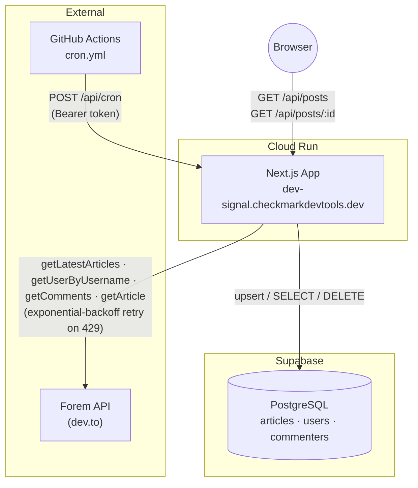
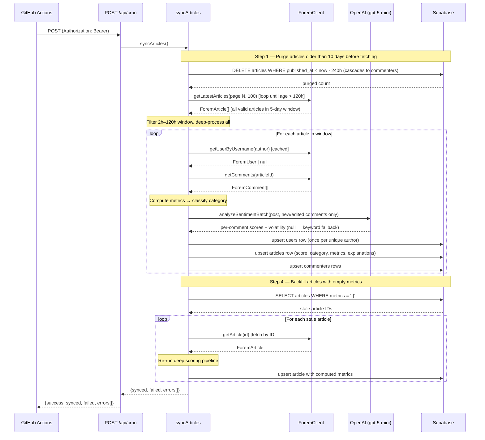
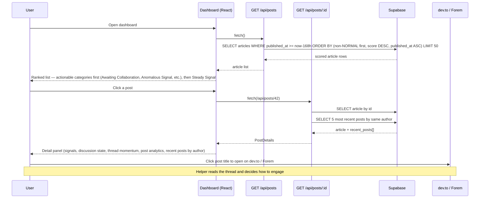
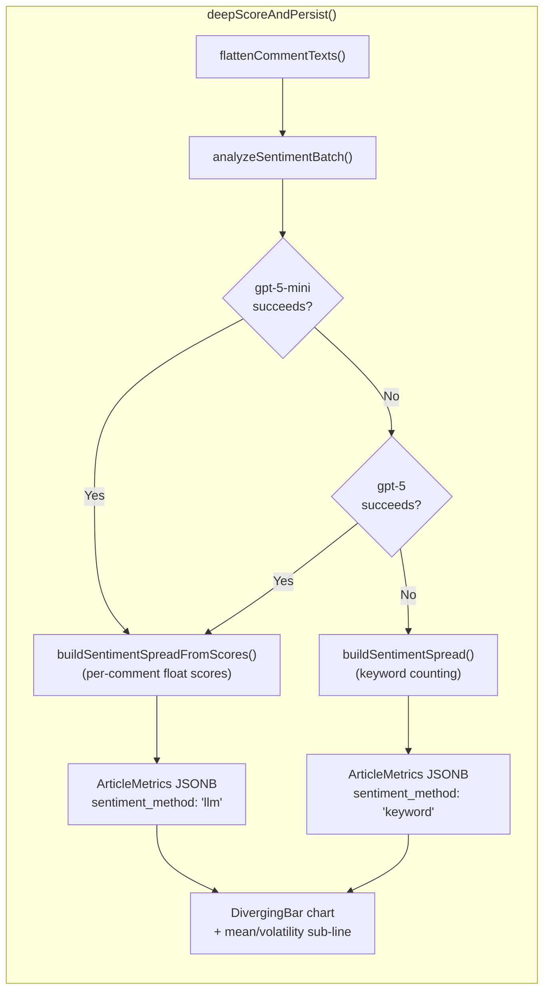

<table>
<tr>
<td><b>Community</b></td>
<td>

[](https://github.com/ChecKMarKDevTools/dev-community-dashboard/stargazers) [](./LICENSE) [](https://dev.to/anchildress1)

</td>
</tr>
<tr>
<td><b>Pipeline</b></td>
<td>

[](https://github.com/ChecKMarKDevTools/dev-community-dashboard/actions/workflows/ci.yml) [](https://github.com/ChecKMarKDevTools/dev-community-dashboard/actions/workflows/cron.yml) [](https://sonarcloud.io/summary/overall?id=ChecKMarKDevTools_forem-community-dashboard) [](https://sonarcloud.io/summary/overall?id=ChecKMarKDevTools_forem-community-dashboard)

</td>
</tr>
<tr>
<td><b>Scans</b></td>
<td>

[](https://trufflesecurity.com/trufflehog) [](https://semgrep.dev) [](https://github.com/hadolint/hadolint) [](https://github.com/rhysd/actionlint) [](https://stylelint.io) [](https://developer.chrome.com/docs/lighthouse)

</td>
</tr>
<tr>
<td><b>Stack</b></td>
<td>

[](https://nextjs.org) [](https://www.typescriptlang.org) [](https://tailwindcss.com) [](https://supabase.com) [](https://vitest.dev) [](https://pnpm.io) [](https://www.docker.com) [](https://cloud.google.com/run)

</td>
</tr>
<tr>
<td><b>Code Quality</b></td>
<td>

[](https://eslint.org) [](https://prettier.io) [](https://www.conventionalcommits.org) [](https://github.com/evilmartians/lefthook) [](https://www.gnu.org/software/make/)

</td>
</tr>
<tr>
<td><b>AI</b></td>
<td>

[](https://claude.ai) [](https://chat.openai.com) [](https://platform.openai.com/docs/models) [](https://gemini.google.com) [](https://leonardo.ai)

</td>
</tr>
<tr>
<td><b>Support</b></td>
<td>

[](https://github.com/sponsors/anchildress1) [](https://buymeacoffee.com/anchildress1)

</td>
</tr>
</table>

# DEV Community Dashboard

A signal-surfacing tool for [Forem](https://forem.com/) communities (dev.to and self-hosted instances). It ingests the latest posts via the public Forem API, classifies each one into attention categories (Awaiting Collaboration, Anomalous Signal, Trending Signal, Rapid Discussion, Steady Signal), and persists the results in Supabase so community helpers can see where conversations need a human eye.

This is **not** a moderation tool or a scorecard. It is designed to help helpers know where to look.

**Production:** [https://dev-signal.checkmarkdevtools.dev](https://dev-signal.checkmarkdevtools.dev) _(Cloud Run — deployed post-initial-release)_

v1.0.0 was created for the [DEV Weekend Challenge](https://dev.to/devteam/happening-now-dev-weekend-challenge-submissions-due-march-2-at-759am-utc-5fg8).

---

## Architecture

### System Overview



### Background Sync Flow

Triggered by the GitHub Actions cron or `workflow_dispatch`. Each run: (1) purges articles older than 10 days (240 h) first, then (2) fetches articles page-by-page (100/page) until the oldest article on a page exceeds the 5-day (120 h) sync window, (3) filters to the 2 h – 120 h age range and deep-scores every valid article, and (4) backfills any articles that were persisted with empty metrics.



### User Interaction Flow

The dashboard is a read-only Next.js client that fetches pre-scored data from Supabase via the API layer. Post titles link directly to dev.to (or the canonical Forem URL) so helpers can jump straight into the conversation.



---

## Scoring Engine

Each article is classified at sync time (not at read time) into one of four attention categories, or `NORMAL` if no thresholds are met. The pipeline first computes common metrics, then applies category-specific IF logic.

### Sentiment Analysis Flow

The sync pipeline uses a two-tier approach for sentiment analysis: LLM-powered scoring when an OpenAI API key is configured, with automatic fallback to keyword-based counting when the key is absent or the LLM call fails.



When the LLM path succeeds, each comment receives a float score (-1.0 to 1.0) and the pipeline computes volatility (0.0–1.0) directly. The `sentiment_method` field in the stored metrics indicates which method produced the data, and the UI surfaces this distinction via the tooltip.

### Common Metrics

| Metric               | Formula                                                                | Importance/Explanation                                                                                  |
| -------------------- | ---------------------------------------------------------------------- | ------------------------------------------------------------------------------------------------------- |
| `word_count`         | count of words in the article body                                     | Indicates content length; longer posts may need summarizing or more attention                           |
| `comments_per_hour`  | `comment_count / max(1, time_since_post / 60)`                         | Measures the pace of discussion; higher rates show active conversations                                 |
| `avg_comment_length` | `total_comment_words / max(1, comment_count)`                          | Reflects depth of responses; longer comments often mean more thoughtful engagement                      |
| `reply_ratio`        | `replies_with_parent / max(1, comment_count)`                          | Shows how conversational the thread is, highlighting back-and-forth replies                             |
| `author_post_freq`   | number of posts by the same author in the last 24 h                    | Helps spot potential spam or overly frequent posts by the same user                                     |
| `effort`             | `log2(word_count + 1) + unique_commenters + (avg_comment_length / 40)` | Captures combined effort by author and commenters; higher effort signals more invested discussions      |
| `exposure`           | `max(1, reactions + comments)`                                         | Shows overall visibility; higher exposure means more attention from the community                       |
| `attention_delta`    | `effort – log2(exposure + 1)`                                          | Measures balance between effort and exposure; positive values suggest undervalued posts needing a boost |

### Categories

| Dashboard Label            | Category         | Key Conditions                                                                                                                  | Interpretation                                                                                                                     |
| -------------------------- | ---------------- | ------------------------------------------------------------------------------------------------------------------------------- | ---------------------------------------------------------------------------------------------------------------------------------- |
| **Awaiting Collaboration** | NEEDS_RESPONSE   | `time_since_post >= 30 min` AND `support_score >= 3` (first post, no reactions, no comments, help words)                        | The post hasn’t received meaningful replies yet. It likely needs someone to step in and start the conversation.                    |
| **Anomalous Signal**       | SIGNAL_AT_RISK   | `risk_score >= 4` (high post freq, short body, no engagement, author promo keywords, repeated links, minus engagement credit)   | Something looks off compared to normal behavior. It may be harmless, but a human should double-check.                              |
| **Rapid Discussion**       | NEEDS_REVIEW     | `comments >= 6` AND `heat_score >= 5` AND `reactions / comments < 1.2`                                                          | The thread is active but unclear. People are talking, just not necessarily about the same thing yet.                               |
| **Trending Signal**        | BOOST_VISIBILITY | `word_count >= 600` AND `unique_commenters >= 2` AND `avg_comment_length >= 18` AND `reactions <= 5` AND `attention_delta >= 3` | The content is useful but under-seen. A little amplification could help the right people find it.                                  |
| **Silent Signal**          | SILENT_SIGNAL    | `reactions >= 5` AND `comments <= 1`                                                                                            | The post is getting noticed (reactions) but isn't drawing conversation. Worth a nudge to get people talking.                       |
| **Steady Signal**          | NORMAL           | Default when no category thresholds are met; also forced for `devteam` org posts (weekly threads, challenges)                   | Routine community activity. Nothing unusual happening, including regular community threads like weekly discussions and challenges. |

### Sub-Scores

| Sub‑score       | Formula / components                                                                                                                        | Importance/Explanation                                                                         |
| --------------- | ------------------------------------------------------------------------------------------------------------------------------------------- | ---------------------------------------------------------------------------------------------- |
| `heat_score`    | `comments_per_hour + reply_ratio * 3 + alternating_pairs + sentiment_flips` (keyword mode) or `... + volatility * comment_count` (LLM mode) | Gauges thread activity and engagement; higher scores flag lively discussions                   |
| `risk_score`    | `max(0, freq_penalty + (word_count < 120 ? 2 : 0) + (no engagement ? 2 : 0) + author_promo_keywords + repeated_links - engagement_credit)`  | Identifies potential quality issues; higher risk means the post may need moderation            |
| `freq_penalty`  | `max(0, author_post_freq – 2) * 2` (only penalizes > 2 posts/day)                                                                           | Discourages spamming by reducing the score of frequent posters                                 |
| `engage_credit` | `(reactions >= 10 ? 2 : 0) + (unique_commenters >= 5 ? 1 : 0)`                                                                              | Rewards well-engaged posts by offsetting risk, so lively discussions aren’t penalized          |
| `support_score` | `(first_post ? 2 : 0) + (no reactions ? 1 : 0) + (no comments ? 2 : 0) + help_keywords`                                                     | Highlights posts needing community support; higher scores mark threads where newbies need help |

### Dashboard Signal Display

The detail panel groups information into three sections. These are display-level labels, not scoring inputs.

| Section                  | Shows                                                                                                      |
| ------------------------ | ---------------------------------------------------------------------------------------------------------- |
| **Conversation Signals** | Per-thread metrics: Word Count, Participants, Effort Level, Attention Shift (values rounded to integers)   |
| **Discussion State**     | Activity Level, Signal Divergence (with risk markers), and Constructiveness with qualitative labels        |
| **Thread Momentum**      | A one-line observation about the current pace of the conversation                                          |
| **Post Analytics**       | Per-post visualizations always rendered; charts show empty states when metrics are unavailable (see below) |

### Post Analytics Visualizations

The detail panel renders five chart types for each post. These show motion and trajectory for a single post against its own baselines — never comparing posts to each other.

| Chart                          | Component            | Data Source                     | What It Shows                                                                                                                                                                                                                |
| ------------------------------ | -------------------- | ------------------------------- | ---------------------------------------------------------------------------------------------------------------------------------------------------------------------------------------------------------------------------- |
| **Reply Velocity**             | `LineChart`          | `velocity_buckets`              | Hourly comment arrivals with a dashed baseline (average)                                                                                                                                                                     |
| **Participation Distribution** | `HorizontalBarChart` | `commenter_shares`              | Top 5 commenters by share of total comments                                                                                                                                                                                  |
| **Sentiment Spread**           | `DivergingBar`       | `positive/neutral/negative_pct` | 3-segment bar showing sentiment balance; LLM mode uses per-comment float scores (thresholds ±0.25), keyword mode uses word matching. Tooltip and sub-line indicate which method and, for LLM, the mean score and volatility. |
| **Constructiveness Trend**     | `LineChart`          | `constructiveness_buckets`      | Average reply depth per hour (higher = more threaded discussion)                                                                                                                                                             |
| **Contributing Signals**       | `MarkerTimeline`     | `risk_components`               | The specific risk factors detected; each marker shows a signal that raised the risk score                                                                                                                                    |

All charts are custom SVG components with zero external chart dependencies. They use the CSS custom property theme (`--chart-grid`, `--chart-axis`, `--chart-series-primary/secondary/tertiary`) for automatic light/dark mode support.

### Contributing Signals

The **Contributing Signals** timeline shows which of the six signals actually triggered for a given post. Each signal is either active (raised the risk score) or inactive (checked but not triggered). Hovering over a signal marker in the UI surfaces the matched value so you can understand _why_ a post received the score it did.

| Signal                   | Field               | Active When                                                                                  | Score Contribution                                           |
| ------------------------ | ------------------- | -------------------------------------------------------------------------------------------- | ------------------------------------------------------------ |
| **Frequency Penalty**    | `frequency_penalty` | Author published > 2 posts in the last 24 h                                                  | `max(0, post_count − 2) × 2` added to risk score             |
| **Short Content**        | `short_content`     | Article body is fewer than 120 words                                                         | +2 to risk score                                             |
| **No Engagement**        | `no_engagement`     | Zero reactions _and_ zero comments at sync time                                              | +2 to risk score                                             |
| **Promotional Keywords** | `promo_keywords`    | Article author's own comments contain words like "subscribe", "buy", "follow", "link in bio" | +1 per matched keyword added to risk score                   |
| **Repeated Links**       | `repeated_links`    | Any external domain appears in comments more than twice                                      | +2 to risk score (capped; triggers once per post)            |
| **Engagement Credit**    | `engagement_credit` | Post has ≥ 10 reactions _or_ ≥ 5 unique commenters                                           | −2 (reactions) or −1 (commenters) subtracted from risk score |

A post reaches **Anomalous Signal** (`SIGNAL_AT_RISK`) when its total risk score is ≥ 4 after summing all active signals and subtracting any engagement credit. The `engagement_credit` signal works in reverse — it is the only signal that _lowers_ the score, preventing high-engagement posts from being flagged.

---

## Running Locally

### Prerequisites

- Node.js ≥ 20
- pnpm
- A [Supabase](https://supabase.com/) project with RLS migrations applied

```bash
# Apply the RLS policy migration to your Supabase project
supabase db push
# or run supabase/migrations/0001_rls_policies.sql manually in the SQL editor
```

### Environment Variables

Create a `.env` file in the project root with the following:

| Variable                   | Required | Description                                                                                                                                                                   |
| -------------------------- | -------- | ----------------------------------------------------------------------------------------------------------------------------------------------------------------------------- |
| `NEXT_PUBLIC_SUPABASE_URL` | ✅ Yes   | Supabase project URL                                                                                                                                                          |
| `SUPABASE_SECRET_KEY`      | ✅ Yes   | Server-only key; bypasses RLS for sync writes                                                                                                                                 |
| `CRON_SECRET`              | ✅ Yes   | Bearer token for `/api/cron` and `/api/admin/seed`                                                                                                                            |
| `DEV_API_KEY`              | No       | Optional; raises Forem API rate limits                                                                                                                                        |
| `OPENAI_API_KEY`           | No       | Optional; enables LLM-powered sentiment analysis. When absent, the sync pipeline falls back to keyword-based sentiment. In production, stored in Google Cloud Secret Manager. |

> `SUPABASE_SECRET_KEY` is intentionally **not** prefixed with `NEXT_PUBLIC_` — it is never sent to the browser.

### Commands

```bash
pnpm install          # install dependencies
pnpm dev              # development server → http://localhost:3000
pnpm test             # run full Vitest test suite
pnpm build            # type-check + Next.js production build
```

### Guardrails

| Guardrail             | Where                                | What it does                                                                                             |
| --------------------- | ------------------------------------ | -------------------------------------------------------------------------------------------------------- |
| Bearer auth           | `/api/cron`, `/api/admin/seed`       | Extracts and trims token from `Authorization: Bearer <CRON_SECRET>`; returns 401 if absent/wrong         |
| Row-level security    | Supabase (`0001_rls_policies.sql`)   | Anon role: `articles` and `commenters` are SELECT-only; `users` has no anon policy (deny-all by default) |
| Input validation      | `/api/posts/[id]`, `/api/admin/seed` | `Number()` + `Number.isInteger()` — floats (`"1.5"`) and alpha strings (`"1abc"`) return 400             |
| Rate-limit resilience | `ForemClient`                        | Exponential-backoff retry on HTTP 429, honours `Retry-After` header                                      |
| Server-only secrets   | `src/lib/supabase.ts`                | Validates both env vars are set at request time; `SUPABASE_SECRET_KEY` never exposed in client bundles   |

---

## API Reference

| Method | Path              | Auth   | Description                                                                  |
| ------ | ----------------- | ------ | ---------------------------------------------------------------------------- |
| `GET`  | `/api/posts`      | none   | Top 50 articles (7-day window), non-NORMAL first → score desc → oldest first |
| `GET`  | `/api/posts/:id`  | none   | Article detail + 5 most recent posts by same author                          |
| `POST` | `/api/cron`       | Bearer | Purge articles > 10 days, then sync articles in the 5-day window from Forem  |
| `POST` | `/api/admin/seed` | Bearer | Same as cron — populate the database on first deploy                         |

---

## Deployment (Cloud Run)

Run `./deploy.sh` from the repo root. The script handles all provisioning steps:
Secret Manager secrets, Artifact Registry, Cloud Build, and Cloud Run deployment.

**Required setup (one-time):**

```bash
gcloud auth login
gcloud config set project checkmarkdevtools
```

Set `APP_URL` as a **GitHub repository variable** and `CRON_SECRET` as a **GitHub secret** so
the cron workflow can reach the deployed endpoint.

---

## GitHub Actions Workflows

Three workflows live in `.github/workflows/`. All CI checks run in `ci.yml`; do not create additional workflow files for individual checks.

| Workflow           | File                 | Trigger                          | What it does                                                                                                                                                                                                         |
| ------------------ | -------------------- | -------------------------------- | -------------------------------------------------------------------------------------------------------------------------------------------------------------------------------------------------------------------- |
| **CI**             | `ci.yml`             | Push to `main`, Pull Request     | Format (Prettier), ESLint, Stylelint, actionlint, Hadolint (Docker), Vitest with coverage (artifact uploaded for SonarCloud), SonarCloud scan, Lighthouse CI (desktop — results written to `.lighthouseci/` locally) |
| **2-Hour Sync**    | `cron.yml`           | Schedule (`0 */2 * * *`), manual | POSTs to `$APP_URL/api/cron` with `Authorization: Bearer $CRON_SECRET`; skips silently if either variable is unset; cancels in-progress runs to avoid overlap                                                        |
| **Release Please** | `release-please.yml` | Push to `main`                   | Opens and updates automated release PRs (Conventional Commits → CHANGELOG + version bump); merging the release PR creates the GitHub Release                                                                         |

### Required repository configuration

| Name           | Type     | Used by           | Notes                                                                                           |
| -------------- | -------- | ----------------- | ----------------------------------------------------------------------------------------------- |
| `APP_URL`      | Variable | `cron.yml`        | Public Cloud Run URL — not a secret, safe to log                                                |
| `CRON_SECRET`  | Secret   | `cron.yml`        | Bearer token; must match the `CRON_SECRET` env var on the deployed service                      |
| `SONAR_TOKEN`  | Secret   | `ci.yml`          | SonarCloud token for the `ChecKMarKDevTools_forem-community-dashboard` project                  |
| `GITHUB_TOKEN` | Built-in | `ci.yml`, release | Provided automatically; `release-please.yml` needs `contents: write` and `pull-requests: write` |

### Lighthouse CI

Lighthouse runs as the last step in `ci.yml` (`pnpm lhci:desktop`). Results are written to `.lighthouseci/` (filesystem target — no external upload service or status-check callback). Minimum thresholds: performance ≥ 0.90 (desktop), accessibility = 1.0 (100%), best-practices ≥ 0.95, SEO = 1.0 (100%). The `.lighthouseci/` directory is git-ignored.

---

## AI & Guardrails

This project uses AI tooling to generate code — and that is precisely why the guardrails are as strict as they are. AI writes plausible-looking code that is sometimes subtly wrong. The CI pipeline, Sonar analysis, test coverage requirements, and pre-commit hooks all exist to catch what AI misses.

AI use is encouraged here, not discouraged. But it is not a standalone solution. Use it with the safety net on.

---

## Contributing

This project is built for community helpers — people who want to know where to look, not what to do. The dashboard surfaces conversations that may need a human eye; it does not assign blame, issue warnings, or score individuals.

If you are contributing, here is where things live:

| Area                                                    | Where to look                                                  |
| ------------------------------------------------------- | -------------------------------------------------------------- |
| Scoring & classification logic                          | `src/lib/sync.ts`                                              |
| Sync pipeline (Forem → Supabase)                        | `src/lib/sync.ts`                                              |
| LLM sentiment analysis (OpenAI)                         | `src/lib/openai.ts`                                            |
| Dashboard UI components                                 | `src/components/Dashboard.tsx` and `src/components/ui/`        |
| Chart components (SVG)                                  | `src/components/ui/charts/`                                    |
| Chart data transformation helpers                       | `src/lib/metrics-helpers.ts`                                   |
| Display helpers (labels, narratives, signal formatting) | `src/lib/dashboard-helpers.ts`                                 |
| API routes                                              | `src/app/api/`                                                 |
| Tests                                                   | Co-located `*.test.ts` / `*.test.tsx` files next to the source |
| CI checks                                               | `.github/workflows/ci.yml` (single workflow for all checks)    |
| Project conventions                                     | `AGENTS.md`                                                    |

---

## Database Migrations

Migration history and schema notes live in [`supabase/README.md`](./supabase/README.md).

---

## Connect & Support

<div align="center">

[](https://dev.to/anchildress1) [](https://linkedin.com/in/anchildress1) [](https://medium.com/@anchildress1) [](https://reddit.com/user/anchildress1)

[](https://github.com/sponsors/anchildress1) [](https://buymeacoffee.com/anchildress1)

</div>

---

## License

This project is licensed under the **[Polyform Shield License 1.0.0](https://polyformproject.org/licenses/shield/1.0.0/)**.

Copyright (c) 2026 ChecKMarK DevTools & Ashley Childress

**In brief:**

- **You CAN** use, copy, fork, or adapt this for your own workflows, inside your company, for client projects, demos, education, or anything else—as long as you are not selling the code, charging for it, or making money from the project itself.
- **You CANNOT** resell, offer as a paid service, or monetize this project or its derivatives without prior written approval from Ashley Childress.
- Any public fork, copy, or substantial reuse must include the `LICENSE` file and a clear attribution statement in your documentation or README:
  > "Based on original work by ChecKMarK DevTools & Ashley Childress – see [https://github.com/checkmarkdevtools/dev-community-dashboard](https://github.com/checkmarkdevtools/dev-community-dashboard)."

For exceptions or monetization/commercialization questions, contact Ashley Childress at [human@checkmarkdevtools.dev](mailto:human@checkmarkdevtools.dev).

See the full [LICENSE](./LICENSE) file for details.
