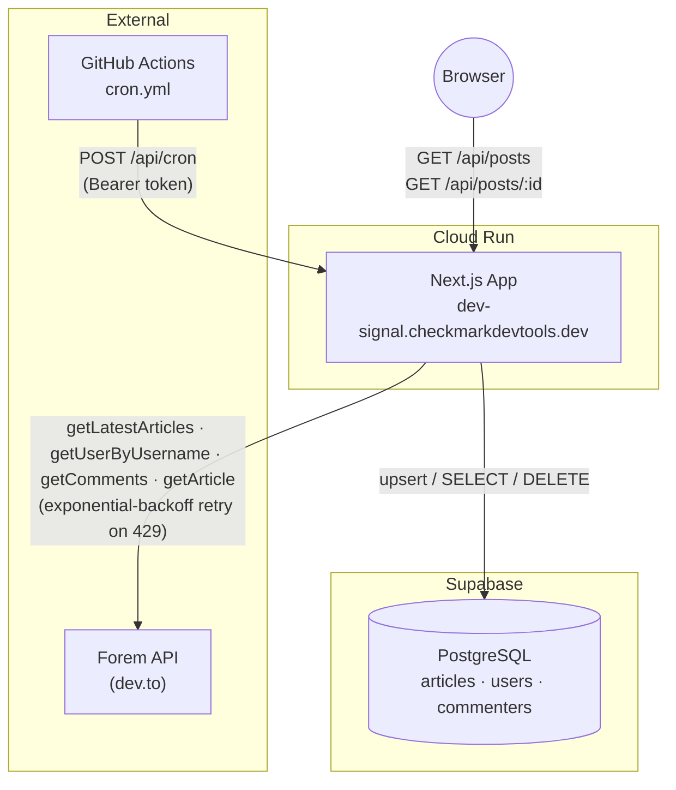
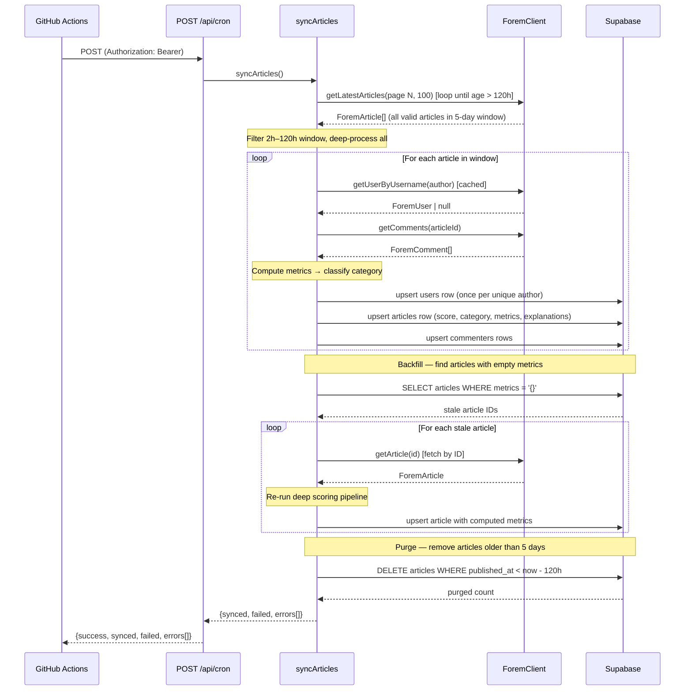
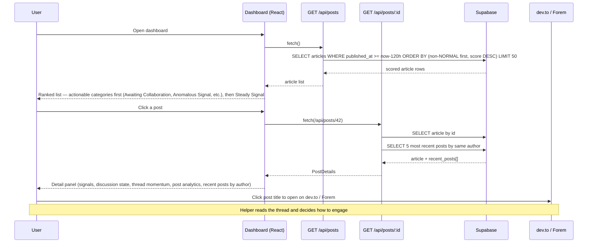

# DEV Community Dashboard


<table>
<tr>
<td><b>Community</b></td>
<td>

[](https://github.com/ChecKMarKDevTools/dev-community-dashboard/stargazers)
[](./LICENSE)
[](https://dev.to/anchildress1)

</td>
</tr>
<tr>
<td><b>Pipeline</b></td>
<td>

[](https://github.com/ChecKMarKDevTools/dev-community-dashboard/actions/workflows/ci.yml)
[](https://github.com/ChecKMarKDevTools/dev-community-dashboard/actions/workflows/cron.yml)
[](https://sonarcloud.io/summary/overall?id=ChecKMarKDevTools_forem-community-dashboard)
[](https://sonarcloud.io/summary/overall?id=ChecKMarKDevTools_forem-community-dashboard)

</td>
</tr>
<tr>
<td><b>Scans</b></td>
<td>

[](https://trufflesecurity.com/trufflehog)
[](https://semgrep.dev)
[](https://github.com/hadolint/hadolint)
[](https://github.com/rhysd/actionlint)
[](https://stylelint.io)
[](https://developer.chrome.com/docs/lighthouse)

</td>
</tr>
<tr>
<td><b>Stack</b></td>
<td>

[](https://nextjs.org)
[](https://www.typescriptlang.org)
[](https://tailwindcss.com)
[](https://supabase.com)
[](https://vitest.dev)
[](https://pnpm.io)
[](https://www.docker.com)
[](https://cloud.google.com/run)

</td>
</tr>
<tr>
<td><b>Code Quality</b></td>
<td>

[](https://eslint.org)
[](https://prettier.io)
[](https://www.conventionalcommits.org)
[](https://github.com/evilmartians/lefthook)
[](https://www.gnu.org/software/make/)

</td>
</tr>
<tr>
<td><b>AI</b></td>
<td>

[](https://claude.ai)
[](https://chat.openai.com)
[](https://gemini.google.com)
[](https://leonardo.ai)

</td>
</tr>
<tr>
<td><b>Support</b></td>
<td>

[](https://github.com/sponsors/anchildress1)
[](https://buymeacoffee.com/anchildress1)

</td>
</tr>
</table>

A signal-surfacing tool for [Forem](https://forem.com/) communities (dev.to and self-hosted instances). It ingests the latest posts via the public Forem API, classifies each one into attention categories (Awaiting Collaboration, Anomalous Signal, Trending Signal, Rapid Discussion, Steady Signal), and persists the results in Supabase so community helpers can see where conversations need a human eye.

This is **not** a moderation tool or a scorecard. It is designed to help helpers know where to look.

**Production:** [https://dev-signal.checkmarkdevtools.dev](https://dev-signal.checkmarkdevtools.dev) _(Cloud Run — deployed post-initial-release)_

v1.0.0 was created for the [DEV Weekend Challenge](https://dev.to/devteam/happening-now-dev-weekend-challenge-submissions-due-march-2-at-759am-utc-5fg8).

---

## Architecture

### System Overview



### Background Sync Flow

Triggered by the GitHub Actions cron or `workflow_dispatch`. Each run fetches articles page-by-page (100/page) until the oldest article on a page exceeds the 5-day (120 h) sync window, filters to the 2 h – 120 h age range, deep-scores every valid article, backfills any articles with empty metrics, upserts results, and purges articles older than 5 days.



### User Interaction Flow

The dashboard is a read-only Next.js client that fetches pre-scored data from Supabase via the API layer. Post titles link directly to dev.to (or the canonical Forem URL) so helpers can jump straight into the conversation.



---

## Scoring Engine

Each article is classified at sync time (not at read time) into one of four attention categories, or `NORMAL` if no thresholds are met. The pipeline first computes common metrics, then applies category-specific IF logic.

### Common Metrics

| Metric               | Formula                                                                | Importance/Explanation                                                                                  |
| -------------------- | ---------------------------------------------------------------------- | ------------------------------------------------------------------------------------------------------- |
| `word_count`         | count of words in the article body                                     | Indicates content length; longer posts may need summarizing or more attention                           |
| `comments_per_hour`  | `comment_count / max(1, time_since_post / 60)`                         | Measures the pace of discussion; higher rates show active conversations                                 |
| `avg_comment_length` | `total_comment_words / max(1, comment_count)`                          | Reflects depth of responses; longer comments often mean more thoughtful engagement                      |
| `reply_ratio`        | `replies_with_parent / max(1, comment_count)`                          | Shows how conversational the thread is, highlighting back-and-forth replies                             |
| `author_post_freq`   | number of posts by the same author in the last 24 h                    | Helps spot potential spam or overly frequent posts by the same user                                     |
| `effort`             | `log2(word_count + 1) + unique_commenters + (avg_comment_length / 40)` | Captures combined effort by author and commenters; higher effort signals more invested discussions      |
| `exposure`           | `max(1, reactions + comments)`                                         | Shows overall visibility; higher exposure means more attention from the community                       |
| `attention_delta`    | `effort – log2(exposure + 1)`                                          | Measures balance between effort and exposure; positive values suggest undervalued posts needing a boost |

### Categories

| Category             | Dashboard Label        | Key Conditions                                                                                                                  |
| -------------------- | ---------------------- | ------------------------------------------------------------------------------------------------------------------------------- |
| **NEEDS_RESPONSE**   | Awaiting Collaboration | `time_since_post >= 30 min` AND `support_score >= 3` (first post, no reactions, no comments, help words)                        |
| **SIGNAL_AT_RISK**   | Anomalous Signal       | `risk_score >= 4` (high post freq, short body, no engagement, author promo keywords, repeated links, minus engagement credit)   |
| **NEEDS_REVIEW**     | Rapid Discussion       | `comments >= 6` AND `heat_score >= 5` AND `reactions / comments < 1.2`                                                          |
| **BOOST_VISIBILITY** | Trending Signal        | `word_count >= 600` AND `unique_commenters >= 2` AND `avg_comment_length >= 18` AND `reactions <= 5` AND `attention_delta >= 3` |
| **NORMAL**           | Steady Signal          | Default when no category thresholds are met; also forced for `devteam` org posts (weekly threads, challenges)                   |

### Sub-Scores

| Sub‑score       | Formula / components                                                                                                                       | Importance/Explanation                                                                         |
| --------------- | ------------------------------------------------------------------------------------------------------------------------------------------ | ---------------------------------------------------------------------------------------------- |
| `heat_score`    | `comments_per_hour + reply_ratio * 3 + alternating_pairs + sentiment_flips`                                                                | Gauges thread activity and engagement; higher scores flag lively discussions                   |
| `risk_score`    | `max(0, freq_penalty + (word_count < 120 ? 2 : 0) + (no engagement ? 2 : 0) + author_promo_keywords + repeated_links - engagement_credit)` | Identifies potential quality issues; higher risk means the post may need moderation            |
| `freq_penalty`  | `max(0, author_post_freq – 2) * 2` (only penalizes > 2 posts/day)                                                                          | Discourages spamming by reducing the score of frequent posters                                 |
| `engage_credit` | `(reactions >= 10 ? 2 : 0) + (unique_commenters >= 5 ? 1 : 0)`                                                                             | Rewards well-engaged posts by offsetting risk, so lively discussions aren’t penalized          |
| `support_score` | `(first_post ? 2 : 0) + (no reactions ? 1 : 0) + (no comments ? 2 : 0) + help_keywords`                                                    | Highlights posts needing community support; higher scores mark threads where newbies need help |

### Dashboard Signal Display

The detail panel groups information into three sections. These are display-level labels, not scoring inputs.

| Section                  | Shows                                                                                                    |
| ------------------------ | -------------------------------------------------------------------------------------------------------- |
| **Conversation Signals** | Per-thread metrics: Word Count, Participants, Effort Level, Attention Shift (values rounded to integers) |
| **Discussion State**     | Activity Level, Signal Divergence (with risk markers), and Constructiveness with qualitative labels      |
| **Thread Momentum**      | A one-line observation about the current pace of the conversation                                        |
| **Post Analytics**       | Per-post visualizations gated on available data (see below)                                              |

### Post Analytics Visualizations

The detail panel renders five chart types for each post. These show motion and trajectory for a single post against its own baselines — never comparing posts to each other.

| Chart                          | Component            | Data Source                     | What It Shows                                                                             |
| ------------------------------ | -------------------- | ------------------------------- | ----------------------------------------------------------------------------------------- |
| **Reply Velocity**             | `LineChart`          | `velocity_buckets`              | Hourly comment arrivals with a dashed baseline (average)                                  |
| **Participation Distribution** | `HorizontalBarChart` | `commenter_shares`              | Top 5 commenters by share of total comments                                               |
| **Sentiment Spread**           | `DivergingBar`       | `positive/neutral/negative_pct` | 3-segment bar showing sentiment balance                                                   |
| **Constructiveness Trend**     | `LineChart`          | `constructiveness_buckets`      | Average reply depth per hour (higher = more threaded discussion)                          |
| **Contributing Signals**       | `MarkerTimeline`     | `risk_components`               | The specific risk factors detected; each marker shows a signal that raised the risk score |

All charts are custom SVG components with zero external chart dependencies. They use the CSS custom property theme (`--chart-grid`, `--chart-axis`, `--chart-series-primary/secondary/tertiary`) for automatic light/dark mode support.

---

## Running Locally

### Prerequisites

- Node.js ≥ 20
- pnpm
- A [Supabase](https://supabase.com/) project with RLS migrations applied

```bash
# Apply the RLS policy migration to your Supabase project
supabase db push
# or run supabase/migrations/0001_rls_policies.sql manually in the SQL editor
```

### Environment Variables

Create a `.env` file in the project root with the following:

| Variable                   | Required | Description                                        |
| -------------------------- | -------- | -------------------------------------------------- |
| `NEXT_PUBLIC_SUPABASE_URL` | ✅ Yes   | Supabase project URL                               |
| `SUPABASE_SECRET_KEY`      | ✅ Yes   | Server-only key; bypasses RLS for sync writes      |
| `CRON_SECRET`              | ✅ Yes   | Bearer token for `/api/cron` and `/api/admin/seed` |
| `DEV_API_KEY`              | No       | Optional; raises Forem API rate limits             |

> `SUPABASE_SECRET_KEY` is intentionally **not** prefixed with `NEXT_PUBLIC_` — it is never sent to the browser.

### Commands

```bash
pnpm install          # install dependencies
pnpm dev              # development server → http://localhost:3000
pnpm test             # run full Vitest test suite
pnpm build            # type-check + Next.js production build
```

### Guardrails

| Guardrail             | Where                                | What it does                                                                                             |
| --------------------- | ------------------------------------ | -------------------------------------------------------------------------------------------------------- |
| Bearer auth           | `/api/cron`, `/api/admin/seed`       | Extracts and trims token from `Authorization: Bearer <CRON_SECRET>`; returns 401 if absent/wrong         |
| Row-level security    | Supabase (`0001_rls_policies.sql`)   | Anon role: `articles` and `commenters` are SELECT-only; `users` has no anon policy (deny-all by default) |
| Input validation      | `/api/posts/[id]`, `/api/admin/seed` | `Number()` + `Number.isInteger()` — floats (`"1.5"`) and alpha strings (`"1abc"`) return 400             |
| Rate-limit resilience | `ForemClient`                        | Exponential-backoff retry on HTTP 429, honours `Retry-After` header                                      |
| Server-only secrets   | `src/lib/supabase.ts`                | Validates both env vars are set at request time; `SUPABASE_SECRET_KEY` never exposed in client bundles   |

---

## API Reference

| Method | Path              | Auth   | Description                                                       |
| ------ | ----------------- | ------ | ----------------------------------------------------------------- |
| `GET`  | `/api/posts`      | none   | Top 50 articles (5-day window), non-NORMAL first, then score desc |
| `GET`  | `/api/posts/:id`  | none   | Article detail + 5 most recent posts by same author               |
| `POST` | `/api/cron`       | Bearer | Sync all articles in the 5-day window from Forem                  |
| `POST` | `/api/admin/seed` | Bearer | Same as cron — populate the database on first deploy              |

---

## Deployment (Cloud Run)

The app is deployed to Google Cloud Run via `deploy.sh`. Set the environment variables listed above as Cloud Run secrets or environment variables:

```bash
gcloud run deploy dev-community-dashboard \
  --set-secrets SUPABASE_SECRET_KEY=...,CRON_SECRET=... \
  --set-env-vars NEXT_PUBLIC_SUPABASE_URL=...,DEV_API_KEY=...
```

Once deployed, set `APP_URL` as a **GitHub repository variable** (not a secret — it is a public URL) and `CRON_SECRET` as a **GitHub secret** so the cron workflow (`.github/workflows/cron.yml`) can reach the live endpoint. By default, this workflow uses a `schedule` trigger to run every 2 hours; to change or disable this cadence, edit or remove the `schedule` block in that file.

---

## Contributing

This project is built for community helpers — people who want to know where to look, not what to do. The dashboard surfaces conversations that may need a human eye; it does not assign blame, issue warnings, or score individuals.

If you are contributing, here is where things live:

| Area                                                    | Where to look                                                  |
| ------------------------------------------------------- | -------------------------------------------------------------- |
| Scoring & classification logic                          | `src/lib/sync.ts`                                              |
| Sync pipeline (Forem → Supabase)                        | `src/lib/sync.ts`                                              |
| Dashboard UI components                                 | `src/components/Dashboard.tsx` and `src/components/ui/`        |
| Chart components (SVG)                                  | `src/components/ui/charts/`                                    |
| Chart data transformation helpers                       | `src/lib/metrics-helpers.ts`                                   |
| Display helpers (labels, narratives, signal formatting) | `src/lib/dashboard-helpers.ts`                                 |
| API routes                                              | `src/app/api/`                                                 |
| Tests                                                   | Co-located `*.test.ts` / `*.test.tsx` files next to the source |
| CI checks                                               | `.github/workflows/ci.yml` (single workflow for all checks)    |
| Project conventions                                     | `AGENTS.md`                                                    |

---

## Database Migrations

All migrations live in `supabase/migrations/` and are applied in order via `supabase db push`.

| Migration           | File                                                               | Description                                                                                          |
| ------------------- | ------------------------------------------------------------------ | ---------------------------------------------------------------------------------------------------- |
| Initial schema      | `0000_initial_schema.sql`                                          | Creates `articles`, `users`, and `commenters` tables with indexes and enables RLS                    |
| RLS policies        | `0001_rls_policies.sql`                                            | Adds anon SELECT-only policies on `articles` and `commenters`; `users` has no anon policy (deny-all) |
| Add dev URL         | `20260228030900_add_dev_url_and_action.sql`                        | Adds `dev_url TEXT` column to `articles` and backfills from `canonical_url`                          |
| Add metrics JSONB   | `20260228235416_add_metrics_jsonb_column_to_articles.sql`          | Adds `metrics JSONB DEFAULT '{}'` column to `articles` for per-post analytics                        |
| Allow null username | `20260301004053_allow_null_commenter_username.sql`                 | Drops `NOT NULL` constraint on `commenters.username` to handle deleted Forem accounts                |
| Rename category     | `20260301040126_rename_possibly_low_quality_to_signal_at_risk.sql` | Renames `POSSIBLY_LOW_QUALITY` category to `SIGNAL_AT_RISK` across all rows                          |

---

## Connect & Support

<div align="center">

[](https://dev.to/anchildress1)
[](https://linkedin.com/in/anchildress1)
[](https://medium.com/@anchildress1)
[](https://reddit.com/user/anchildress1)

[](https://github.com/sponsors/anchildress1)
[](https://buymeacoffee.com/anchildress1)

</div>

---

## License

This project is licensed under the **[Polyform Shield License 1.0.0](https://polyformproject.org/licenses/shield/1.0.0/)**.

Copyright (c) 2026 ChecKMarK DevTools & Ashley Childress

**In brief:**

- **You CAN** use, copy, fork, or adapt this for your own workflows, inside your company, for client projects, demos, education, or anything else—as long as you are not selling the code, charging for it, or making money from the project itself.
- **You CANNOT** resell, offer as a paid service, or monetize this project or its derivatives without prior written approval from Ashley Childress.
- Any public fork, copy, or substantial reuse must include the `LICENSE` file and a clear attribution statement in your documentation or README:
  > "Based on original work by ChecKMarK DevTools & Ashley Childress – see [https://github.com/checkmarkdevtools/dev-community-dashboard](https://github.com/checkmarkdevtools/dev-community-dashboard)."

For exceptions or monetization/commercialization questions, contact Ashley Childress at [human@checkmarkdevtools.dev](mailto:human@checkmarkdevtools.dev).

See the full [LICENSE](./LICENSE) file for details.
