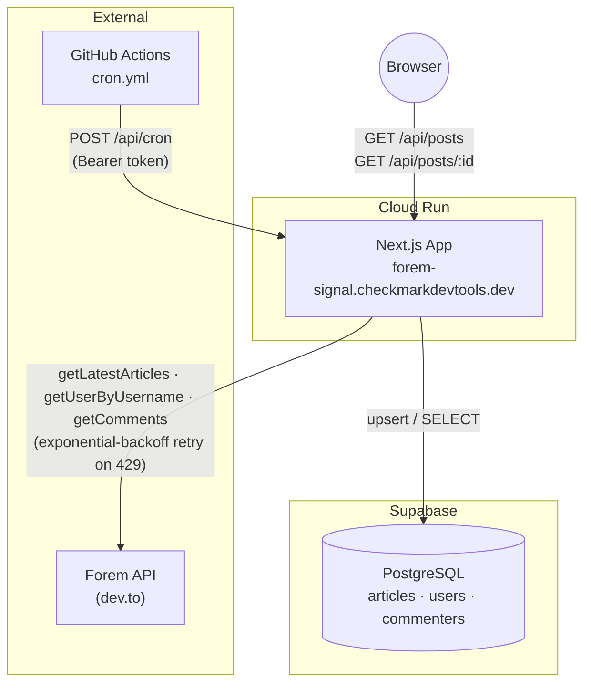
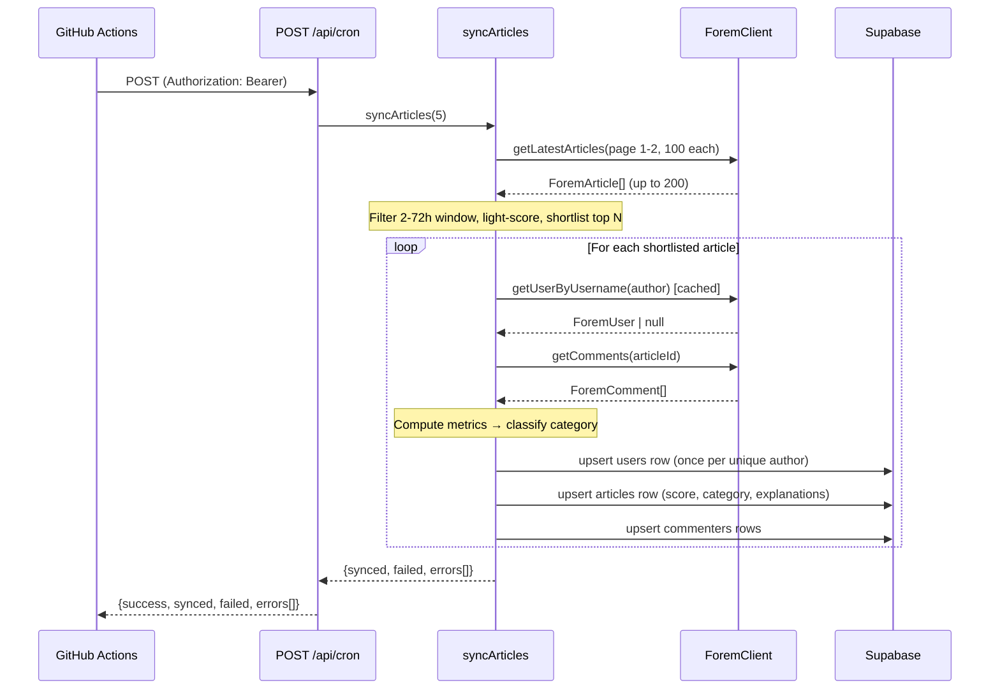
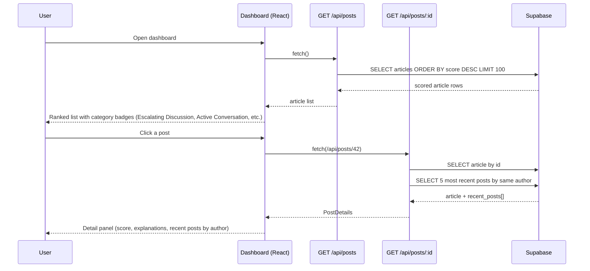

# Forem Community Observability Dashboard

A moderation intelligence dashboard for [Forem](https://forem.com/) communities (dev.to and self-hosted instances). It ingests the latest posts via the public Forem API, classifies each one into actionable categories (Escalating Discussion, Active Conversation, Community Waiting, Potential Rule Issue, Routine Discussion), and persists the results in Supabase so community managers can surface posts needing attention at a glance.

**Production:** https://forem-signal.checkmarkdevtools.dev _(Cloud Run — deployed post-initial-release)_

---

## Architecture

### System Overview



### Background Sync Flow

Triggered by the GitHub Actions cron or `workflow_dispatch`. Each run fetches up to 200 articles (2 pages), filters to the 2-72h window, light-scores and shortlists top candidates, deep-fetches comments, classifies into categories, and upserts results.



### User Interaction Flow

The dashboard is a read-only Next.js client that fetches pre-scored data from Supabase via the API layer.



---

## Scoring Engine

Each article is classified at sync time (not at read time) into one of four attention categories, or `NORMAL` if no thresholds are met. The pipeline first computes common metrics, then applies category-specific IF logic.

### Common Metrics

| Metric               | Formula                                                                |
| -------------------- | ---------------------------------------------------------------------- |
| `word_count`         | `reading_time_minutes * 200` (estimated)                               |
| `comments_per_hour`  | `comment_count / max(1, time_since_post / 60)`                         |
| `avg_comment_length` | `avg(words(comment.body_html))`                                        |
| `reply_ratio`        | `replies_with_parent / max(1, comment_count)`                          |
| `author_post_freq`   | Posts by the same author in the last 24 h                              |
| `engagement`         | `reactions + (comments * 2)`                                           |
| `effort`             | `log2(word_count + 1) + unique_commenters + (avg_comment_length / 40)` |
| `exposure`           | `max(1, reactions + comments)`                                         |
| `attention_delta`    | `effort - log2(exposure + 1)`                                          |

### Categories

| Category                 | Key Conditions                                                                                                                  |
| ------------------------ | ------------------------------------------------------------------------------------------------------------------------------- |
| **NEEDS_RESPONSE**       | `time_since_post >= 30 min` AND `support_score >= 3` (first post, no reactions, no comments, help words)                        |
| **POSSIBLY_LOW_QUALITY** | `risk_score >= 4` (high post freq, short body, no engagement, author promo keywords, repeated links, minus engagement credit)   |
| **NEEDS_REVIEW**         | `comments >= 6` AND `heat_score >= 5` AND `reactions / comments < 1.2`                                                          |
| **BOOST_VISIBILITY**     | `word_count >= 600` AND `unique_commenters >= 2` AND `avg_comment_length >= 18` AND `reactions <= 5` AND `attention_delta >= 3` |
| **NORMAL**               | Default when no category thresholds are met; also forced for `devteam` org posts (weekly threads, challenges)                   |

### Sub-Scores

| Sub-Score       | Components                                                                                                                           |
| --------------- | ------------------------------------------------------------------------------------------------------------------------------------ |
| `heat_score`    | `comments_per_hour + reply_ratio * 3 + alternating_pairs + sentiment_flips`                                                          |
| `risk_score`    | `max(0, freq_penalty + (short body ? 2 : 0) + (no engagement ? 2 : 0) + author_promo_keywords + repeated_links - engagement_credit)` |
| `freq_penalty`  | `max(0, author_post_freq - 2) * 2` (only penalizes > 2 posts/day)                                                                    |
| `engage_credit` | `(reactions >= 10 ? 2 : 0) + (unique_commenters >= 5 ? 1 : 0)` (offsets risk for high-traction posts)                                |
| `support_score` | `(first_post ? 2 : 0) + (no reactions ? 1 : 0) + (no comments ? 2 : 0) + help_keywords`                                              |

---

## Running Locally

### Prerequisites

- Node.js ≥ 20
- pnpm
- A [Supabase](https://supabase.com/) project with RLS migrations applied

```bash
# Apply the RLS policy migration to your Supabase project
supabase db push
# or run supabase/migrations/0001_rls_policies.sql manually in the SQL editor
```

### Environment Variables

Create a `.env` file in the project root with the following:

| Variable                   | Required | Description                                        |
| -------------------------- | -------- | -------------------------------------------------- |
| `NEXT_PUBLIC_SUPABASE_URL` | Yes      | Supabase project URL                               |
| `SUPABASE_SECRET_KEY`      | Yes      | Server-only key; bypasses RLS for sync writes      |
| `CRON_SECRET`              | Yes      | Bearer token for `/api/cron` and `/api/admin/seed` |
| `FOREM_API_KEY`            | No       | Optional; raises Forem API rate limits             |

> `SUPABASE_SECRET_KEY` is intentionally **not** prefixed with `NEXT_PUBLIC_` — it is never sent to the browser.

### Commands

```bash
pnpm install          # install dependencies
pnpm dev              # development server → http://localhost:3000
pnpm test             # run full Vitest test suite
pnpm build            # type-check + Next.js production build
```

### Guardrails

| Guardrail             | Where                                | What it does                                                                                             |
| --------------------- | ------------------------------------ | -------------------------------------------------------------------------------------------------------- |
| Bearer auth           | `/api/cron`, `/api/admin/seed`       | Returns 401 if `Authorization: Bearer <CRON_SECRET>` header is absent or wrong                           |
| Row-level security    | Supabase (`0001_rls_policies.sql`)   | Anon role: `articles` and `commenters` are SELECT-only; `users` has no anon policy (deny-all by default) |
| Input validation      | `/api/posts/[id]`, `/api/admin/seed` | `Number()` + `Number.isInteger()` — floats (`"1.5"`) and alpha strings (`"1abc"`) return 400             |
| Rate-limit resilience | `ForemClient`                        | Exponential-backoff retry on HTTP 429, honours `Retry-After` header                                      |
| Server-only secrets   | `src/lib/supabase.ts`                | `SUPABASE_SECRET_KEY` only used server-side; never exposed in client bundles                             |

---

## API Reference

| Method | Path              | Auth   | Description                                                        |
| ------ | ----------------- | ------ | ------------------------------------------------------------------ |
| `GET`  | `/api/posts`      | none   | Scored article list, ordered by score desc, limit 100              |
| `GET`  | `/api/posts/:id`  | none   | Article detail + 5 most recent posts by same author                |
| `POST` | `/api/cron`       | Bearer | Sync latest 100 articles from Forem (page 1)                       |
| `POST` | `/api/admin/seed` | Bearer | Back-fill articles; body `{ "days": N }` (integer 1–90, default 3) |

---

## Deployment (Cloud Run)

The app is deployed to Google Cloud Run via `deploy.sh`. Set the environment variables listed above as Cloud Run secrets or environment variables:

```bash
gcloud run deploy forem-community-dashboard \
  --set-secrets SUPABASE_SECRET_KEY=...,CRON_SECRET=... \
  --set-env-vars NEXT_PUBLIC_SUPABASE_URL=...,FOREM_API_KEY=...
```

Once deployed, set `APP_URL` as a **GitHub repository variable** (not a secret — it is a public URL) and `CRON_SECRET` as a **GitHub secret** so the cron workflow (`.github/workflows/cron.yml`) can reach the live endpoint. Uncomment the `schedule` trigger in that file to enable the 15-minute cadence.

---

## License

This project is licensed under the **[Polyform Shield License 1.0.0](https://polyformproject.org/licenses/shield/1.0.0/)**.

Copyright (c) 2026 ChecKMarK DevTools & Ashley Childress

**In brief:**

- **You CAN** use, copy, fork, or adapt this for your own workflows, inside your company, for client projects, demos, education, or anything else—as long as you are not selling the code, charging for it, or making money from the project itself.
- **You CANNOT** resell, offer as a paid service, or monetize this project or its derivatives without prior written approval from Ashley Childress.
- Any public fork, copy, or substantial reuse must include the `LICENSE` file and a clear attribution statement in your documentation or README:
  > "Based on original work by ChecKMarK DevTools & Ashley Childress – see [https://github.com/checkmarkdevtools/forem-community-dashboard](https://github.com/checkmarkdevtools/forem-community-dashboard)."

For exceptions or monetization/commercialization questions, contact Ashley Childress at [human@checkmarkdevtools.dev](mailto:human@checkmarkdevtools.dev).

See the full [LICENSE](./LICENSE) file for details.
