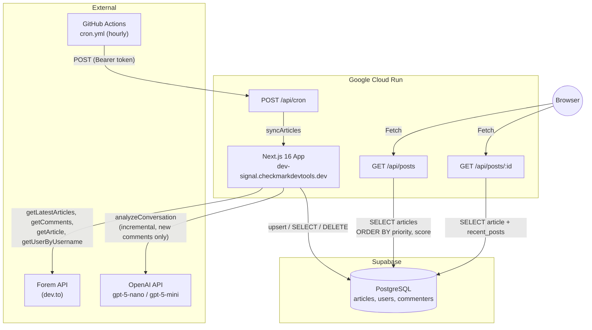
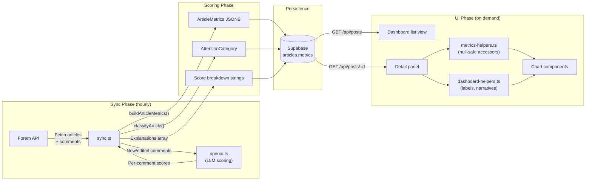

# Architecture

High-level architecture of the DEV Community Dashboard. For interaction signal specifics, see [Interaction Signal](./interaction-signal.md). For a full field reference, see [Metrics Reference](./metrics.md).

---

## System Overview

---

## Key Directories

| Directory                   | Contents                                                                              |
| --------------------------- | ------------------------------------------------------------------------------------- |
| `src/app/`                  | Next.js App Router: pages and API route handlers                                      |
| `src/app/api/`              | API routes: `posts/`, `posts/[id]/`, `cron/`, `admin/seed/`                           |
| `src/components/`           | React components: `Dashboard.tsx` and the `ui/` component library                     |
| `src/components/ui/`        | Reusable UI components: Badge, Card, QueueCard, ScoreBar, etc.                        |
| `src/components/ui/charts/` | Custom SVG chart components: LineChart, HorizontalBarChart, SignalBar, MarkerTimeline |
| `src/lib/`                  | Core logic: sync pipeline, scoring, Forem client, OpenAI integration, helpers         |
| `src/types/`                | TypeScript interfaces: `ArticleMetrics`, `Post`, `PostDetails`, `AttentionCategory`   |
| `supabase/`                 | Database migrations and schema documentation                                          |
| `.github/workflows/`        | CI (`ci.yml`), cron sync (`cron.yml`), release automation (`release-please.yml`)      |

---

## Data Flow

The pipeline has three distinct phases: sync, scoring, and rendering.

### Sync Phase

1. GitHub Actions triggers `POST /api/cron` hourly.
2. The sync pipeline purges articles older than 10 days, then fetches articles within the 5-day window from the Forem API.
3. For each article: fetch full body, fetch comment tree, compute structural metrics.
4. Incremental LLM scoring: only new or edited comments are sent to OpenAI. Cached scores are preserved. See [Interaction Signal -- Incremental Scoring](./interaction-signal.md#incremental-scoring).
5. The article is classified into an attention category (Awaiting Collaboration, Anomalous Signal, etc.).

### Scoring Phase

All scoring happens at sync time, not at read time. The `buildArticleMetrics()` function assembles the full `ArticleMetrics` JSONB object, and `classifyArticle()` assigns the attention category. Results are persisted to Supabase.

### UI Phase

The dashboard fetches pre-scored data from Supabase via the API layer. Data transformation from `ArticleMetrics` to chart props happens in `metrics-helpers.ts`, not inside React components. Display labels and narratives come from `dashboard-helpers.ts`.

---

## API Routes

| Method | Path              | Auth   | Description                                                                |
| ------ | ----------------- | ------ | -------------------------------------------------------------------------- |
| `GET`  | `/api/posts`      | None   | Top 50 articles (7-day window), non-NORMAL first, score desc, oldest first |
| `GET`  | `/api/posts/:id`  | None   | Article detail + 5 most recent posts by same author                        |
| `POST` | `/api/cron`       | Bearer | Purge + sync articles in the 5-day window                                  |
| `POST` | `/api/admin/seed` | Bearer | Same as cron -- populate the database on first deploy                      |

---

## Deployment

The project deploys to Google Cloud Run via `deploy.sh`. The script provisions Secret Manager secrets, Artifact Registry, Cloud Build, and the Cloud Run service.

Environment variables:

| Variable                   | Required | Description                                                  |
| -------------------------- | -------- | ------------------------------------------------------------ |
| `NEXT_PUBLIC_SUPABASE_URL` | Yes      | Supabase project URL                                         |
| `SUPABASE_SECRET_KEY`      | Yes      | Server-only key; bypasses RLS for sync writes                |
| `CRON_SECRET`              | Yes      | Bearer token for `/api/cron` and `/api/admin/seed`           |
| `DEV_API_KEY`              | No       | Raises Forem API rate limits                                 |
| `OPENAI_API_KEY`           | No       | Enables LLM interaction scoring; absent = heuristic fallback |

---

## Guardrails

| Guardrail             | Where                                | What It Does                                                       |
| --------------------- | ------------------------------------ | ------------------------------------------------------------------ |
| Bearer auth           | `/api/cron`, `/api/admin/seed`       | Token validation; 401 if absent/wrong                              |
| Row-level security    | Supabase (migration `0001`)          | Anon: SELECT-only on `articles` and `commenters`; `users` deny-all |
| Input validation      | `/api/posts/[id]`, `/api/admin/seed` | Rejects floats, alpha strings with 400                             |
| Rate-limit resilience | `ForemClient`                        | Exponential-backoff retry on HTTP 429                              |
| Server-only secrets   | `src/lib/supabase.ts`                | `SUPABASE_SECRET_KEY` never in client bundles                      |

---

## Related Documentation

- [Interaction Signal](./interaction-signal.md) -- composite signal formula, LLM pipeline, heuristic fallback, incremental scoring
- [Metrics Reference](./metrics.md) -- full `ArticleMetrics` field reference, risk components, velocity, participation
