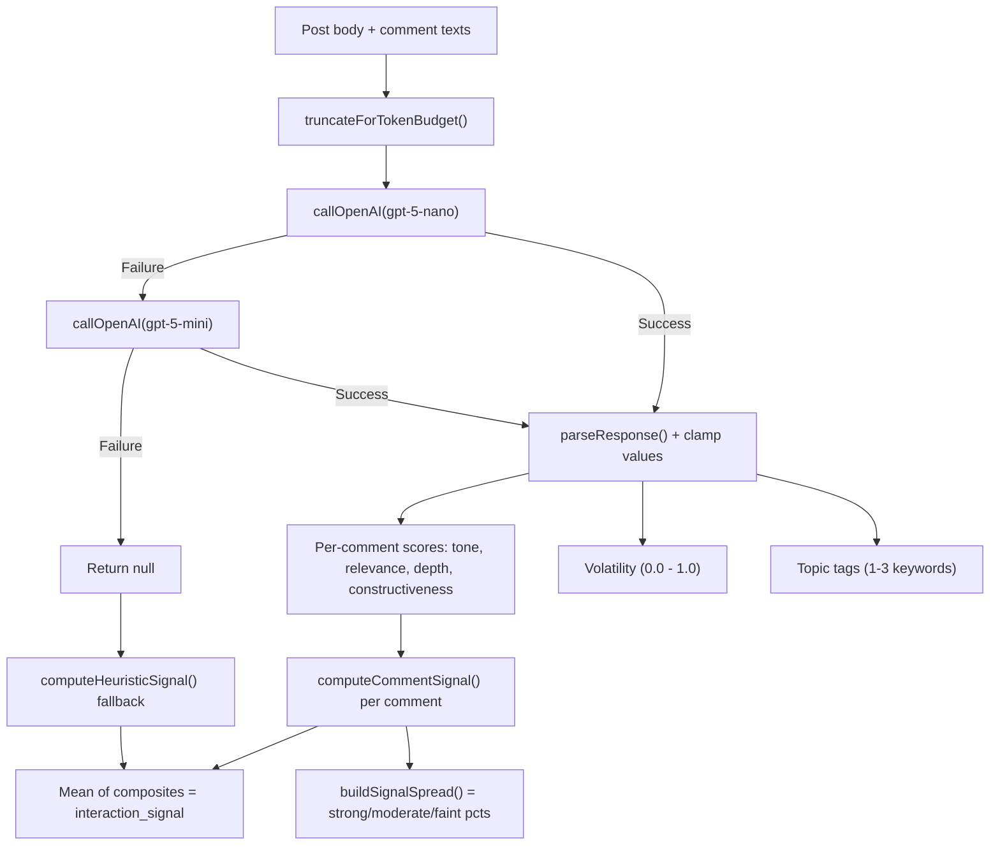
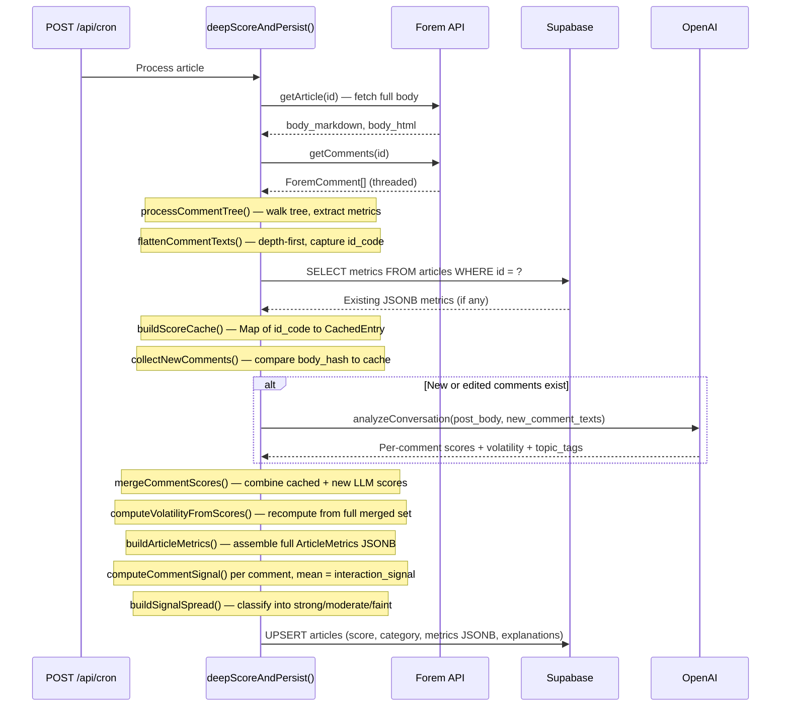

# Interaction Signal

The interaction signal is the headline metric on the DEV Community Dashboard. It answers one question: **how can you contribute most constructively to this conversation?**

This dashboard is a signal-surfacing tool, not a moderation panel. It does not score individuals, flag content for removal, or assign blame. The interaction signal measures the depth and substance of comments in a thread — showing community helpers the conversational context so they can tailor their response: calm and neutral for heated threads, detailed and encouraging for posts lacking engagement, or on-topic for discussions that have drifted.

---

## Composite Signal Formula

Each comment receives four dimension scores from the LLM (or heuristic fallback). The composite signal for a single comment is:

```
composite = relevance * 0.3 + depth * 0.3 + constructiveness * 0.3 + normalizedTone * 0.1
```

Where `normalizedTone = (tone + 1) / 2` maps the tone range `[-1, 1]` to `[0, 1]`.

The weighting is deliberate: **90% substance, 10% tone**. A comment that is blunt but technically substantive scores higher than a polite but empty comment. The signal prioritizes conversational value over politeness.

The post-level `interaction_signal` is the arithmetic mean of all per-comment composites.

---

## Per-Comment Scoring Dimensions

The LLM (or heuristic fallback) assigns four scores to each comment:

| Dimension            | Range       | What It Measures                                                                 |
| -------------------- | ----------- | -------------------------------------------------------------------------------- |
| **Tone**             | -1.0 to 1.0 | Emotional tone in context. Negative = hostile/dismissive, positive = supportive. |
| **Relevance**        | 0.0 to 1.0  | How directly the comment addresses the post's topic.                             |
| **Depth**            | 0.0 to 1.0  | Surface-level reaction ("great post!") vs. substantive/technical content.        |
| **Constructiveness** | 0.0 to 1.0  | Whether the comment meaningfully advances the discussion.                        |

All values are clamped to their valid ranges if the LLM returns out-of-bound values (logged as warnings, not rejected).

---

## LLM Scoring Pipeline

The pipeline sends the post body and comments to the OpenAI Responses API with a structured JSON schema. The model returns per-comment scores, overall volatility, and 1-3 topic tags.



### Model Cascade

The pipeline uses a two-tier model cascade to balance cost and reliability:

| Priority | Model      | Role                                                                                     |
| -------- | ---------- | ---------------------------------------------------------------------------------------- |
| Primary  | gpt-5-nano | Low-cost, fast. Handles the majority of scoring requests.                                |
| Fallback | gpt-5-mini | Higher-capacity model. Used only when the primary model fails (API error, rate limit).   |
| Final    | Heuristic  | Zero-cost structural analysis. Used when both models fail or `OPENAI_API_KEY` is absent. |

Each tier catches its own errors independently. The cascade does not retry within a tier -- it moves to the next tier on any failure.

### Token Budget

The input is truncated to stay within a predictable token budget. Budget
values account for the `Comment N: ` prefix and `\n` separator overhead so
the final prompt string stays within the stated limits:

- Post body: 4,000 characters
- Per-comment: 500 characters each
- Total comments: 12,000 characters cumulative (≈ 23 full-length comments)

gpt-5-nano supports a 400K-token context window (~1.6M chars); these limits
are intentionally conservative to keep per-sync costs predictable while still
covering a typical thread in full.

---

## Heuristic Fallback

When both LLM tiers fail (or `OPENAI_API_KEY` is not configured), the pipeline computes a heuristic interaction signal from structural conversation features. No AI model is involved.

```
heuristicSignal =
    replySignal   * 0.3    // min(1, reply_ratio)
  + lengthSignal  * 0.3    // min(1, avg_comment_length / 100)
  + pairSignal    * 0.2    // min(1, alternating_pairs / 5)
  + diversitySignal * 0.2  // min(1, distinct_commenters / 10)
```

| Component         | Normalization                      | Max Value | What It Captures                                          |
| ----------------- | ---------------------------------- | --------- | --------------------------------------------------------- |
| `replySignal`     | `min(1, reply_ratio)`              | 1.0       | Proportion of comments that are replies (back-and-forth). |
| `lengthSignal`    | `min(1, avg_comment_length / 100)` | 1.0       | Average comment word count; 100 words = ceiling.          |
| `pairSignal`      | `min(1, alternating_pairs / 5)`    | 1.0       | Count of A-replies-to-B-replies-to-A pairs; 5 = ceiling.  |
| `diversitySignal` | `min(1, distinct_commenters / 10)` | 1.0       | Unique participants; 10 = ceiling.                        |

The heuristic produces a `0.0 - 1.0` score on the same scale as the LLM composite. If the post has zero comments, the heuristic returns `0`.

The `interaction_method` field in the stored metrics indicates which path produced the data (`"llm"` or `"heuristic"`), and the UI displays this distinction.

---

## Signal Spread

After computing per-comment composite scores, the pipeline classifies each comment into a signal tier:

| Tier              | Composite Range | Meaning                                                        |
| ----------------- | --------------- | -------------------------------------------------------------- |
| **Substantive**   | > 0.6           | Comment is on-topic, adds depth, and advances the discussion.  |
| **Mixed**         | 0.3 - 0.6       | Some value present, but the comment is partial or tangential.  |
| **Surface-level** | < 0.3           | Noise, pleasantries, or off-topic content with minimal signal. |

The spread is stored as three percentage fields: `signal_strong_pct`, `signal_moderate_pct`, `signal_faint_pct`. These are rendered in the UI as a `SignalBar` (three-segment horizontal bar chart).

---

## Threshold-Based Guidance

The `getSignalSummary()` function translates the numeric interaction signal into terse guidance:

| Signal Range   | Summary                                   |
| -------------- | ----------------------------------------- |
| >= 0.7         | "Discussion substantive and on-topic."    |
| 0.4 - 0.69     | "Mixed depth. Focused reply can help."    |
| 0.01 - 0.39    | "Mostly surface-level. Add depth."        |
| 0              | "No comments. Early shaping opportunity." |
| method=unknown | "No interaction data."                    |

These summaries are displayed directly below the SignalBar chart in the detail panel.

---

## Incremental Scoring

The pipeline avoids re-scoring unchanged comments across sync runs. Each comment is keyed by two fields:

| Key Field   | Source                     | Purpose                                                       |
| ----------- | -------------------------- | ------------------------------------------------------------- |
| `id_code`   | Forem comment `id_code`    | Stable identifier for the comment across syncs.               |
| `body_hash` | djb2 hash of stripped text | Detects edits. If the hash changes, the comment is re-scored. |

The incremental flow:

1. `buildScoreCache()` loads existing `interaction_scores` from the article's JSONB metrics column into a `Map<id_code, CachedEntry>`.
2. `collectNewComments()` walks the current comment tree and compares each comment's `body_hash` to the cache. Only new or edited comments are collected for LLM scoring.
3. `analyzeConversation()` is called with only the new/edited comments (saving API cost).
4. `mergeCommentScores()` combines cached scores with fresh LLM scores into a single enriched array.
5. Volatility is recomputed from the full merged tone scores (not just new LLM scores) via `computeVolatilityFromScores()`.

The djb2 hash function is a deterministic, zero-dependency polynomial hash.
It iterates Unicode code points (via `for...of`) rather than UTF-16 code
units, so non-BMP characters (emoji, some CJK) are counted exactly once and
produce stable hashes across all text inputs:

```
hash = 0
for each Unicode code point cp in text:   // for...of, not char-index loop
    hash = ((hash << 5) - hash + cp) >>> 0
return hex(hash)
```

---

## Topic Tag Extraction

When the LLM path succeeds, the response includes 1-3 topic keywords extracted from the post body (`topic_tags`). These are:

- Stored in the metrics JSONB
- Displayed as small labels below the interaction signal chart in the UI
- Not used in scoring -- they are informational only

If the LLM returns more than 3 tags, they are truncated to 3. If the heuristic path is used, no topic tags are generated.

---

## Volatility

Volatility measures how much tone varies across comments in a thread:

- `0.0` = all comments have the same tone (uniform)
- `1.0` = extreme variation in tone across comments

In LLM mode, volatility is the standard deviation of all per-comment tone scores, clamped to `[0, 1]`. It is computed from the full merged score set (including cached scores from prior syncs), not just the scores from the current LLM call.

In heuristic mode, volatility is not computed.

The volatility value is displayed in the UI next to the interaction signal and method indicator when the method is `"llm"`.

---

## End-to-End Sync Pipeline

The following diagram shows how the interaction signal fits into the broader sync pipeline:



---

## UI Rendering

The interaction signal is displayed in the detail panel under "Post Analytics" as an "Interaction Signal" chart. The UI shows:

1. **SignalBar** -- three-segment bar (substantive / mixed / surface-level percentages)
2. **Signal summary** -- plain-English guidance from `getSignalSummary()`
3. **Metadata line** -- numeric signal value, method (LLM or Heuristic), and volatility percentage (LLM only)
4. **Topic tags** -- small labels when LLM-extracted tags are available
5. **Per-comment breakdown** -- expandable `<details>` element showing each comment's tone, relevance, depth, and constructiveness scores (metric transparency)

All values are surfaceable to the user. No hidden metrics.

---

## Needs Support Detection

The `NEEDS_SUPPORT` attention level surfaces posts where the **author** is struggling -- emotional distress, burnout, isolation, or explicit help-seeking. It is the highest-priority attention level, appearing above all others in the queue.

### Detection: Dual-Layer (LLM + Keyword Safety Net)

**LLM layer (primary):** The LLM structured output schema includes a `needs_support: boolean` field. The system prompt instructs the model to set it to `true` when the post body contains genuine signals of distress -- not routine technical questions or casual frustration.

**Keyword safety net (fallback):** When both LLM tiers fail and the pipeline falls back to heuristic mode, a `SUPPORT_SIGNAL_PHRASES` array in `sentiment-keywords.ts` scans the lowercased post body for phrase matches. If two or more phrases match, `needs_support` is set to `true`. This is a conservative threshold to reduce false positives.

Detection targets the **post body**, not comments. The rationale: a community member expressing distress will do so in the post itself.

### Phrases (keyword safety net)

The current phrase list includes: "i'm struggling", "feeling overwhelmed", "burned out", "burnout", "mental health", "feeling alone", "i can't cope", "considering quitting", "imposter syndrome", "i'm lost", "don't know what to do", "need someone to talk to", "feeling isolated", "i'm failing", "can't keep up".

These are **phrase** matches (not single words) to avoid false positives. They are exported for UI tooltip transparency.

### Classification Priority

`NEEDS_SUPPORT` is checked first in `classifyArticle()`, after the devteam org bypass. It takes precedence over all other categories. The queue sort order places it at priority 0 (ahead of `NEEDS_RESPONSE` at 1).

### Badge

The `NEEDS_SUPPORT` badge uses a rose variant -- warm and compassionate, distinct from the red used for risk signals. The rose color tokens are WCAG AA compliant in both light and dark modes.

### Metrics Persistence

The `needs_support` boolean is stored in the `ArticleMetrics` JSONB column. It is preserved across incremental syncs: when no LLM call is made (all comments cached), the pipeline carries forward the existing `needs_support` value from the prior sync.

---

## Related Files

| File                                     | Purpose                                                                                                                                |
| ---------------------------------------- | -------------------------------------------------------------------------------------------------------------------------------------- |
| `src/lib/sync.ts`                        | `computeCommentSignal`, `buildSignalSpread`, `computeHeuristicSignal`, `buildArticleMetrics`, incremental scoring functions            |
| `src/lib/openai.ts`                      | LLM integration: `analyzeConversation`, model cascade, token truncation, response parsing                                              |
| `src/types/metrics.ts`                   | `ArticleMetrics` interface with all interaction signal fields                                                                          |
| `src/lib/metrics-helpers.ts`             | Null-safe accessors: `getInteractionSignal`, `getSignalSpreadData`, `getTopicTags`, `getInteractionVolatility`, `getInteractionMethod` |
| `src/lib/dashboard-helpers.ts`           | `getSignalSummary()` -- actionable framing thresholds                                                                                  |
| `src/components/Dashboard.tsx`           | Detail panel rendering of interaction signal chart and metadata                                                                        |
| `src/components/ui/charts/SignalBar.tsx` | Three-segment bar chart component                                                                                                      |
| `src/lib/sentiment-keywords.ts`          | `SUPPORT_SIGNAL_PHRASES`, `countSupportPhrases()` -- keyword safety net for needs-support detection                                    |
